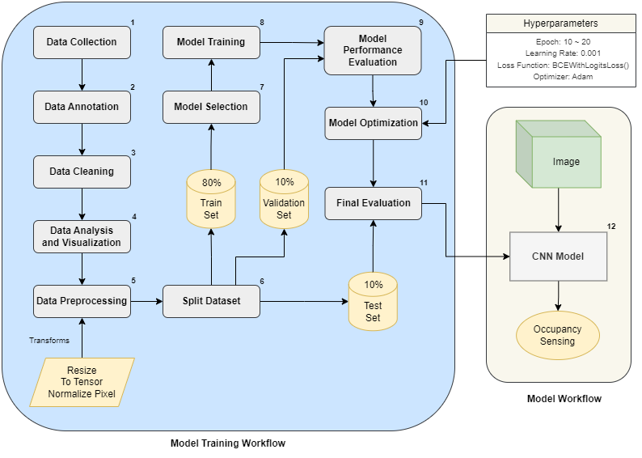
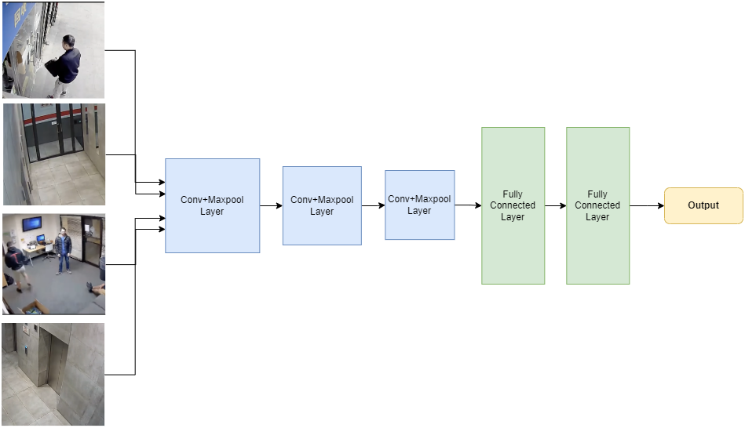

# Camera-Based Occupancy Sensing Using AI for Smart Home Applications

## Description
Since the onset of modern housing technology, it has undergone serious changes that facilitate innovation compliant with user’s application, safety, and other factors. One example is that AI-based Camera-based Occupancy Sensing leads the way in capturing data on the presence and absence of individuals within homes. Our project utilizes state-of-the-art Convolutional Neural Networks (CNNs) such as ResNet50, MobileNet V3, EfficientNet B0, MobileNet V2, and MobileNet V3 Small to come up with an advanced real-time occupancy detection system.

To develop this system, we employed various data types of videos taken from different sources including treating hospitals and some other spaces to train the model comprehensively. Our computational configuration was furnished with robust processing and graphics capabilities that supplied adequate facilities for demanding image processing operations. A complex optimization technique was used for optimizing our models that improved their precision and functioning dramatically.

## Methodology

### Specifications of Software Block Diagram:

### Simulation:

